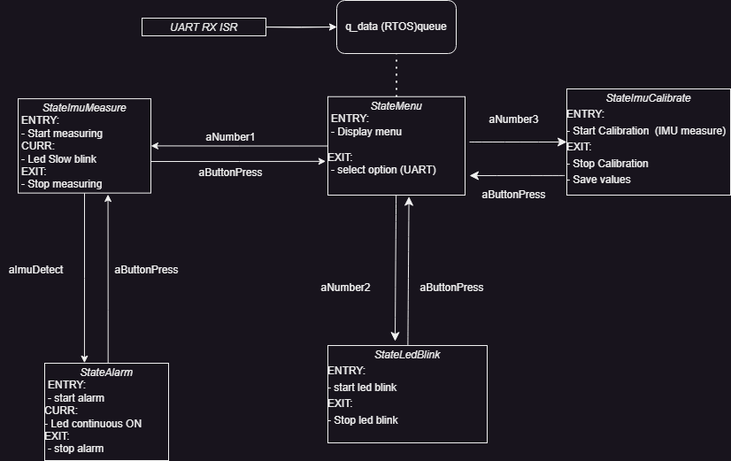

# STM32 RTOS Project with ADXL345 Accelerometer Driver

Embedded software project that aims to implement an RTOS (Real-Time Operating System) on the STM32 microcontroller and integrate an ADXL345 accelerometer driver. The project's intent is to showcase the developer's skills in RT embedded systems.

Necessities:
- ADXL345 accelerometer (in this project, connected over I2C to PB8-SCL & PB9-SDA)
- Active buzzer (connected to PA0 and GND)
- Green Led (connected to PA5 and GND)
- STM32f446RE board

The project is developed using the CubeIDE and makes use of the CMSIS (Cortex Microcontroller Software Interface Standard) library and the HAL (Hardware Abstraction Layer) library provided by STMicroelectronics. It interfaces directly with FreeRTOS.
The project includes:
- An RTOS implementation using FreeRTOS, providing round robin scheduling for the tasks and making use of the RTOS notification mechanism.
- A driver for the ADXL345 accelerometer, enabling the measurement of three-axis acceleration data and implementation of motion detection algorithms.
- A user interface with a serial console interface for sending commands and receiving data from the STM32 board.

A rough state diagram is shown below:

The code itself is documented in-detail.
If you're an employer or recruiter interested in evaluating my skills, feel free to review the source code & contact me on linkedin.